# Hospitality Occupancy Sensor Documentation

**Prepared For**

Luis Garcia

Corserva/EntryReady

**Prepared By**

Jack Edwards

Florida Polytechnic University
# A Letter to Corserva

Dear Luis Garcia and and rest of Corserva/EntryReady,

You may find the assembly instructions on both the software and hardware sides of the occupancy sensor project you have sponsored below. This document is similar to the PDF documentation sent with this project. This README, as well as the PDF, detail the steps used to replicate the hardware and software assembly for testing the project.

This README, as well as the PDF documentation, does not cover the website functionality nor server implementation. The website was later listed as a secondary requirement in the project’s final weeks and server implementation was never included in our project scope. Do not attempt to contact us to work on this project further as we are no longer under an educational obligation to work for you anymore. If you need further assistance for this project, ask Luis Garcia, who was our sponsor contact for this project.

On behalf of the rest of the team, thank you for sponsoring this project that we can claim as our senior project. We completed the project to the best of our abilities and we hope that you may use our project to further benefit the company in the future, whether that will be the documentation, sensor hardware, the website, or other parts of the project that we spent since last September working on. We wish you all the best of luck with your future projects.

Yours Truly,

Jack Edwards

# Sections List

1 - Physical Assembly

-- 1.1 - Materials List

-- 1.2 - Wiring

-- 1.3 - Assembly Instructions

2 - Software Assembly

-- 2.1 - Home Assistant

+++ 2.1.1 - Home Assistant Materials
	
+++ 2.1.2 - Installing Home Assistant Operating System

+++ 2.1.3 - Home Assistant Onboarding

-- 2.2 - ESPHome & MMWave Code

+++ 2.2.1 - ESPHome Environment

+++ 2.2.2 - Installing MMWave Code

## 1. Physical Assembly

This section contains the steps used to physically assemble the sensor created for this project. The materials used, the wiring done, and the assembly itself is written here.

## 1.1 - Materials List
Here are the materials used to compose the sensor:
* D1 Mini
* DFRobot SEN0395
* Mini USB cable & USB power supply
    * A phone charger or similar charger can be used for this material.
* Soldering Iron
* 2 Inches of Wire
* 3D Printed Case
    * These cases should already be provided for you.

## 1.2 - Wiring
Using the pins that come with the D1 Mini, the following wiring was done:
(Sensor Pin to D1 Mini Pin is what the following format is.)

TX to D1

RX to D2

IO1 is not connected

IO2 to D0 using the wire

G to G

V to 5V

The D1, D2, G, and 5V pins use soldered header and pin connections while the D0 pin uses a soldered wire connection.

## 1.3 - Assembly Instructions

This section goes through how to assemble the sensor step by step.

1. Solder the header connectors and the single wire to the D1 Mini as per the “Wiring” section.
a. Cut a half inch of insulation from the loose wire end.
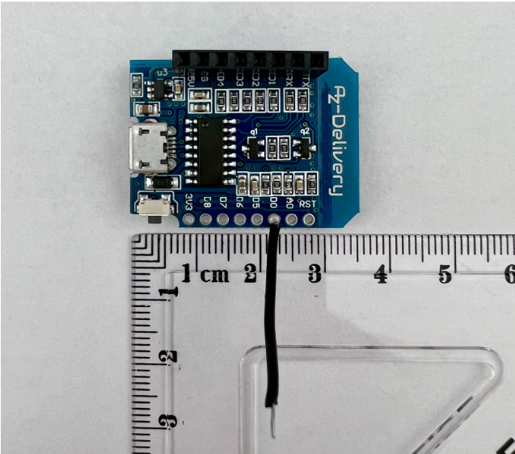

2. Solder the pins on the TX, RX, G, and V pins on the sensor.

3. Solder the loose wire end to the sensor’s IO2 pin.
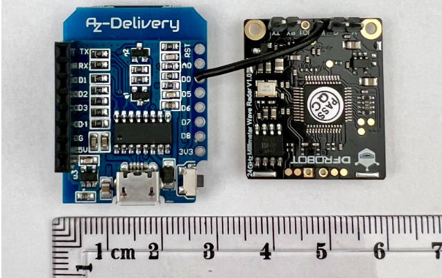

4. Plug the sensor into the D1 Mini while ensuring the sensor’s V pin is aligned to the D1 Mini’s 5V pin.
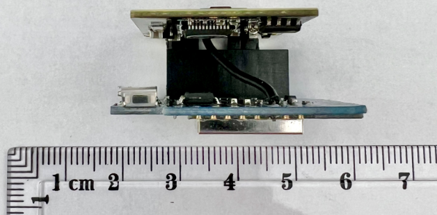
# 2. Software Assembly

This section contains the instructions for how to set up the software components of the project. This includes how to set up Home Assistant on a Raspberry Pi, ESPHome, the mmWave code, and configuring Home Assistant parameters.

## 2.1 - Home Assistant
Section 2.1 covers the materials and assembly instructions used to start Home Assistant on a Raspberry Pi. 

### 2.1.1 - Home Assistant Materials
The following materials were used to start setting up Home Assistant:
- Raspberry Pi 4

- Power Supply for Raspberry Pi 4

- Micro SD Card

- Ethernet Cable

    - An ethernet cable is required for the initial connection.

### 2.1.2 - Installing Home Assistant Operating System
These are the instructions used to install the Home Assistant operating system on a Raspberry Pi 4.

1. Insert the SD card into your computer.

2. Download and start Balena Etcher (Link: www.balena.io/etcher). Enable administrator privileges if requested.

3. From the resulting window, a three-step diagram will appear. From the leftmost icon, click on the “Flash from URL” button.

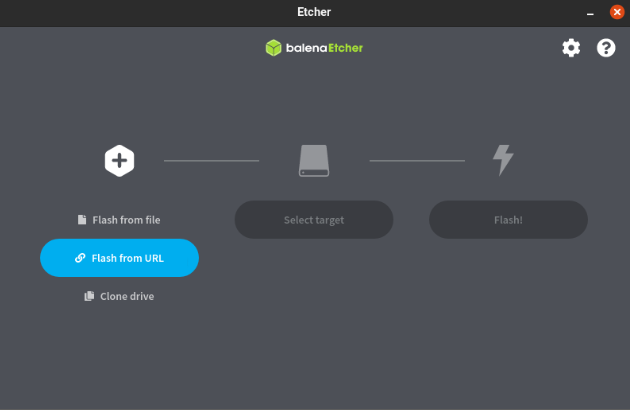

4. Copy and paste the following link for the image URL, then click on the “OK” button: https://github.com/home-assistant/operating-system/releases/download/9.5/haos_rpi4-64-9.5.img.xz 

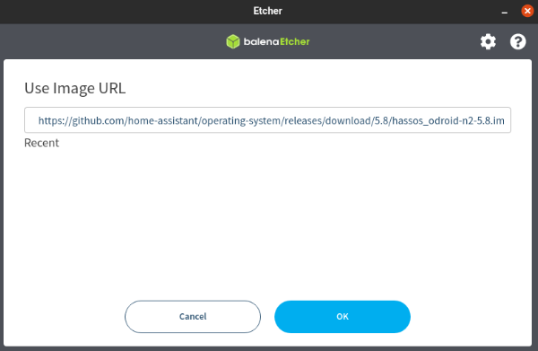

5. Wait for Balena to download the image. When it has done so, the middle icon will light up. Click on the “Select Target” button from the center icon. 

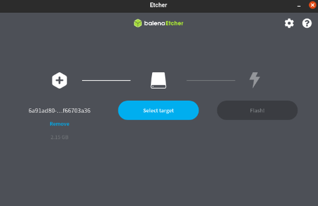

6. Select the SD card you have inserted earlier, then click on the “Select” button. 

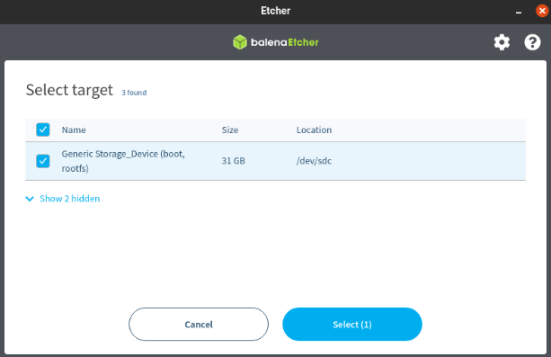

7. The rightmost icon should brighten now. Click on the “Flash!” button to write the Raspberry Pi image to the SD card. 

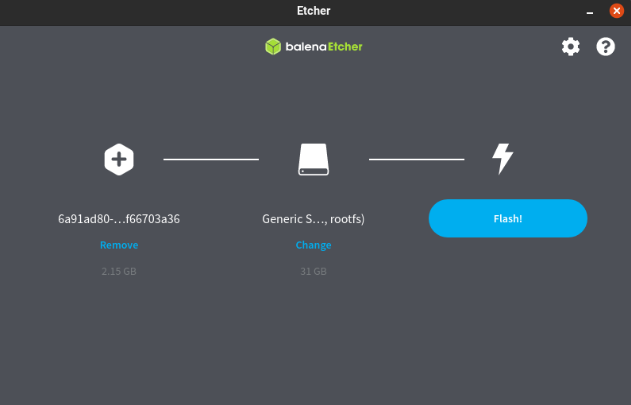

8. When you see a confirmation screen, eject your SD card from your computer and insert it into your Raspberry Pi.

9. Plug in the ethernet cable from the network to the Pi and then power the Pi.

10. Wait for a few minutes before checking to see if Home Assistant is accessible. After waiting, go to a web browser and paste homeassistant.local:8123 into the webpage bar. If you reach a web page, the installation was successful.
If you have a stricter network configuration, enter http://X.X.X.X:8123 into the webpage bar instead, replacing “X.X.X.X” with the Raspberry Pi’s IP address.

### 2.1.3 - Home Assistant Onboarding
After installing and accessing the Home Assistant operation system as described in 2.1.2, these are the instructions to start configuring Home Assistant.

1. The first screen presented will be an account creation page. This will be the account used to access Home Assistant. Enter your name, username, and password you will use for Home Assistant, then click on the “Create Account” button.

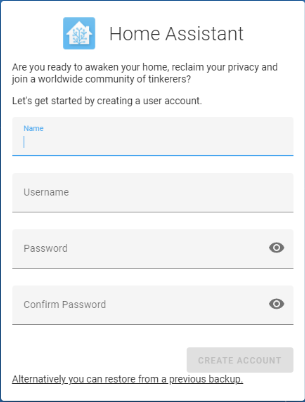

2. Using the backup found in the “Home Assistant” folder in this repository, you can restore the testing Home Assistant instance. The credentials will be relayed via email for protection.

3. The next screen will be setting up your home location. You can click on the “Detect” link to allow Home Assistant to retrieve your current location, time zone, elevation, and unit system, but these values can be manually filled as well. When you filled out the values, click on “Next”. 

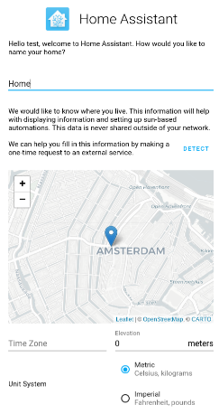

4. You will now be presented to the devices screen. You can set up devices that Home Assistant detects (you are looking for an “ESPHome” device), but if you don’t see your device in the screen, it can be connected later. Click on the “Finish” link to finish initial configuration. 

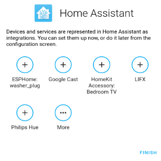

5. You will now be presented to the Home Assistant dashboard. To connect any devices not connected initially, go to “Settings” -> “Devices & Services” from the left column. You may find your device in the “Discovered” section, but if not, click on the “Add Integration” button and find your device there. 

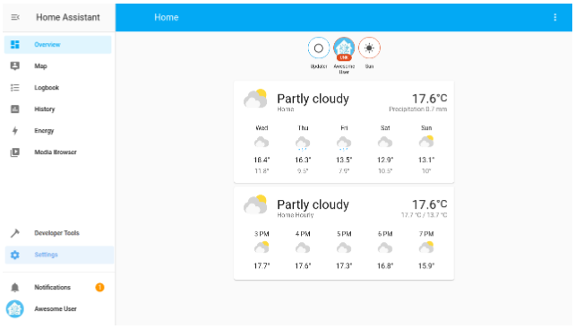

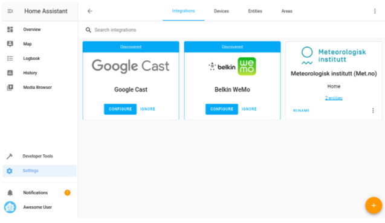

## 2.2 - ESPHome & MMWave Code
This section covers how to install ESPHome and set up the MMWave code.

### 2.2.1 - ESPHome Environment
The following steps were performed to start the ESPHome environment:
1. Go to the following link and enter the webpage used in 2.1.2, step 10, then click on “Save”: https://my.home-assistant.io/redirect/supervisor_addon/?addon=5c53de3b_esphome&repository_url=https%3A%2F%2Fgithub.com%2Fesphome%2Fhome-assistant-addon
By default, homeassistant.local:8123 is filled, but use http://X.X.X.X:8123 instead if that is what was used.

2. Wait for ESPHome to be installed (it will take a while), then click on “Start” then “Open Web UI”. If you encounter a “502: Bad Gateway” error, then ESPHome is still starting up, so refresh the page later. 

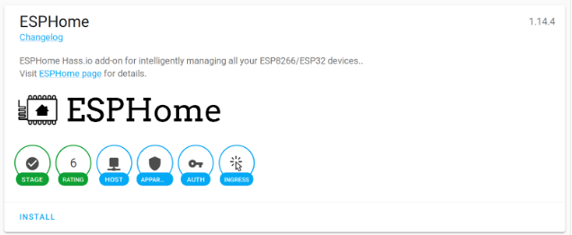

3. Proceed through the installation wizard to connect the ESP32 with Home Assistant.

The installation will require an ethernet cable connected from the ESP32 to the computer for the initial connection. Further connections can be made using WiFi. 

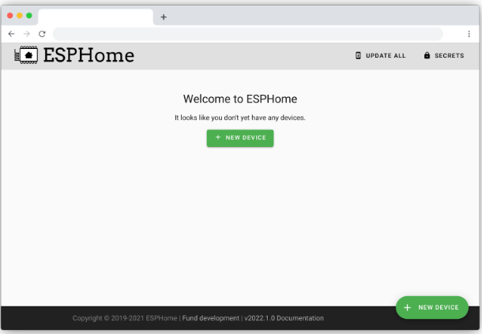

### 2.2.2 - Installing MMWave Code

The following steps detail how to install the MMWave code after configuring an ESPHome environment.

1. Copy the “Home Assistant” folder in this repository to your build environment.

2. Copy the files from the Home Assistant Folder into your ESPHome build Directory. Specifically, the “packages” and “header” folders should be in the ESPHome directory because “sensor.yaml” depends on it.

3. Open the file named “sensor.yaml” and edit the values to your setup:

“device_name”: The sensor’s device name that must be in all lowercase with spaces represented by hyphens.
Example: room-201-sensor

“device_name_pretty”: The sensor’s device name that will be shown in Home Assistant. Capital letters and spaces are allowed here.
Example: Room 201 Sensor

“ssid”: The device’s 2.4 ghz WiFi SSID.

“wifi_password”: The password from the previous SSID.

4. Do not change the variables “uart_tx_pin”, “uart_rx_pin”, and “gpio_pin” unless you are using different pin connections from Section 1.

5. Deploy the MMWave code from your ESPHome environment.
